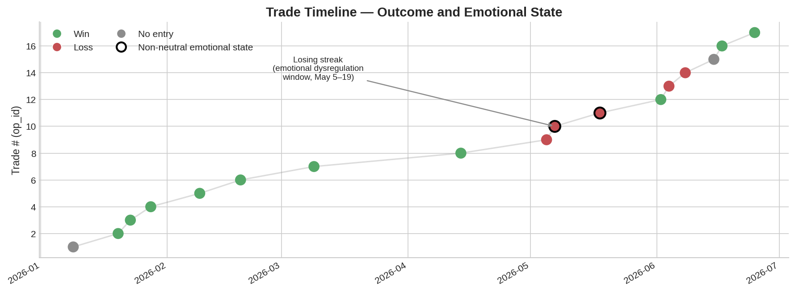
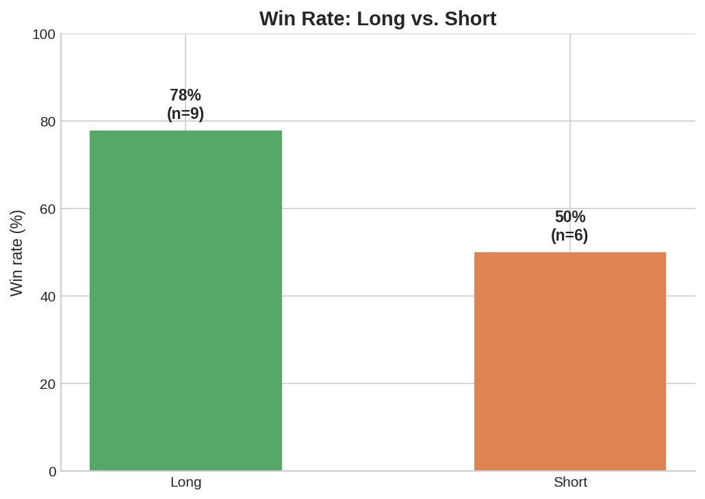
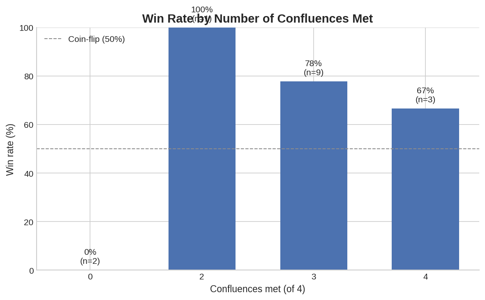

# XAU Swing Trading Lab — XAUUSD Trading Journal & Behavioral Analysis
## Research Journal, Strategy Development & Behavioral Analysis

A structured backtest and self-audit of a discretionary swing-trading system on Gold (XAUUSD), built to answer one question with data instead of gut feeling: **when I lose, is it the market, or is it me?**

This repository documents a custom TradingView indicator, a 17-trade paper-trading log with annotated chart evidence, a statistical breakdown of what actually drives outcomes, and a revised, data-backed rule set (v2) derived directly from the findings — including a formal "circuit breaker" rule aimed at the single largest source of losses in the sample: post-loss decision-making, not analysis quality.

## Why this exists

Trading is, at its core, a repeated decision-making process under uncertainty with real risk-management and P&L accountability — the same discipline that underlies variance analysis, control testing, and process auditing in a finance function. This project applies that lens to my own execution: structured logging, root-cause classification of losses, and a revised operating procedure validated (and reviewed) against the data rather than assumption. It was originally built to support a disciplined return to a funded trading account; it turned into a small case study in treating personal decision data with the same rigor as any other dataset.

*Personal note*
My background spans software development, psychology and finance, which naturally led me to approach discretionary trading as a decision-making and data-analysis problem rather than purely a market-prediction exercise.

I entered the trading world in 2019. What began as curiosity became a long-term pursuit that ended up bringing together many of the interests that have shaped my professional and academic journey: systems, human behaviour, uncertainty, statistics and performance.

For me, trading has never been only about markets or money. It is one of the few environments where every decision is exposed to immediate feedback and where excuses have very little value. The market does not care about intentions, confidence or opinions; it only reveals the consequences of the decisions made.

Over time, I became less interested in forecasting price movements and more interested in understanding the decision-maker behind them. In many ways, trading became a continuous exercise in auditing my own judgement, discipline and behaviour under uncertainty.

This repository is the result of that mindset: an attempt to transform subjective decisions into an auditable dataset, analyse them with intellectual honesty, and learn not only how the market behaves, but also how I behave when interacting with it.

## My Contribution

I am the author of the entire trading framework analysed in this repository, including:

- The TradingView indicator, designed and programmed by me in Pine Script v6.
- The strategy logic and confluence model used for trade selection.
- The trade journal and behavioral classification framework.
- The Python-based statistical analysis used to review the results.

This project therefore combines indicator development, process design, data collection and quantitative analysis within a single end-to-end workflow.

## Key findings

**1. The single biggest source of losses wasn't market analysis — it was what happened after a loss.**

The only losing streak in the entire log (3 consecutive losses, May 5–19) starts with one clean loss and turns into a chain of indiscipline — one trade explicitly self-logged as a "revenge trade," another annotated directly on the chart mid-review with *"why don't you follow the plan!!!"*. The two only non-neutral emotional states in 17 trades fall exactly inside this window.



**2. Long and Short setups are not symmetric — even under the identical rule set.**

Rule-compliant Long trades: **6/6, 100%.** Rule-compliant Short trades: **3/6, 50%.** Reviewing the annotated charts for the Short losses showed that 2 of the 3 were not directional misreads — the trend call was right — but stop-placement failures: price hit the stop via the sweep's own wick before completing the anticipated move. That reframes the fix from "shorts don't work" to "the stop needs to sit beyond the sweep zone," a much narrower and more actionable correction.



**3. A minimum-confluence rule is empirically justified, not just a nice idea.**

Every trade taken with zero of the four defined confluences lost — 0% win rate, and both instances also coincided with rule violations and elevated emotional states. It's a small n (2), but it's corroborated by an independent variable rather than resting on the outcome alone.



Full breakdown, including the compliance-vs-outcome analysis and all sample-size caveats, in [`analysis/statistical-summary.md`](analysis/statistical-summary.md).

## Repository structure

```
XAU-swing-trading-lab/
├── README.md                          this file
├── LICENSE
├── requirements.txt
├── data/
│   ├── operations.csv                 all 17 logged trades, structured
│   └── data-dictionary.md             field definitions and data integrity notes
├── analysis/
│   ├── generate_charts.py             reproducible chart generation from operations.csv
│   ├── statistical-summary.md         full statistical write-up
│   └── charts/                        generated PNG charts (committed for easy viewing)
├── strategy/
│   ├── strategy-v1.md                 base indicator: logic, components, entry rules
│   ├── strategy-v2.md                 revised rules derived from the backtest findings
│   └── ema-gold-trader-2026.pine      Pine Script v6 source for the TradingView indicator
└── images/
    └── op_1.png ... op_17.png         annotated TradingView screenshots, one per trade
```

## The strategy, in short

**v1 — [EMA Gold Trader 2026](strategy/strategy-v1.md):** a Pine Script indicator combining a three-EMA trend filter (EMA 60 / DEMA 60 / EMA 200), an automatic liquidity-sweep detector (wick-based stop-hunt identification), and a live confluence-status table. Entries are scored on four confluences: market structure, EMA alignment, indicator signal, and liquidity sweep.

**v2 — [Adapted rules](strategy/strategy-v2.md):** everything v1 alone couldn't tell me. Direction-specific stop placement, an EMA-200-as-conviction-multiplier rule (not a standalone signal — validated in one case, explicitly falsified in another, and documented as such), and the emotional circuit breaker described above. v2 doesn't replace the indicator; it's the execution and risk-management layer that only becomes visible after reviewing real trades against real outcomes.

## Methodology notes

- **All 17 trades are paper-traded (simulated).** This is a pre-funding discipline audit, not a live P&L record, and it's labeled that way throughout — including the trades that were emotionally driven losses, kept in the dataset for honesty rather than excluded to flatter the numbers.
- **The TradingView status table only reflects the most recent candle, never a historical one.** Every chart screenshot in `/images` includes this table, and it is deliberately *not* used to reconstruct historical confluence state — that state is read from the annotated price action itself and logged in `operations.csv` at the time of the trade.
- **"Market structure" is a defined term, not a vague one.** Wherever this project says "structure," it refers to market structure in the technical-analysis / SMC sense — price action, liquidity, BOS/CHoCH, order blocks — and is tracked as a confluence independent from EMA alignment, which is a separate, mechanical check. This distinction was tightened mid-project specifically to stop the two concepts being conflated in earlier notes.
- **Sample size is small and stated as such everywhere it matters.** n=17 (n=6 per direction on shorts) is enough to surface behavioral patterns worth acting on immediately (the circuit breaker rule, in particular, doesn't need a large sample to justify itself), but not enough to treat win-rate percentages as a stable statistical edge. The explicit review trigger for that — 30–50 trades per direction — is documented in [`strategy/strategy-v2.md`](strategy/strategy-v2.md#10-when-to-revisit-this-version).

## Reproducing the analysis

```bash
git clone https://github.com/alexhb-maker/XAU-swing-trading-lab.git
cd XAU-swing-trading-lab
pip install -r requirements.txt
python analysis/generate_charts.py
```

This regenerates every chart in `analysis/charts/` directly from `data/operations.csv`, so the numbers in this README are always reproducible from the underlying data, not hardcoded.

## Tech stack

`Python` (pandas, matplotlib) for data processing and chart generation · `Pine Script v6` for the TradingView indicator · `Notion` for the live trading journal this dataset was exported from · Markdown/CSV for everything here, so the whole project stays readable with zero setup.

## Roadmap

- [ ] Grow the dataset to 30–50 trades per direction and re-run the statistical summary
- [ ] Validate whether the v2 short-side stop rule actually closes the Long/Short win-rate gap
- [ ] Track whether the emotional circuit breaker measurably prevents another losing streak
- [ ] Revisit the Long-side 100% assumption once a non-trending regime shows up in the data

## License

MIT — see [LICENSE](LICENSE). Trade data, screenshots, and strategy notes are shared for portfolio and educational purposes; nothing here is financial advice.
