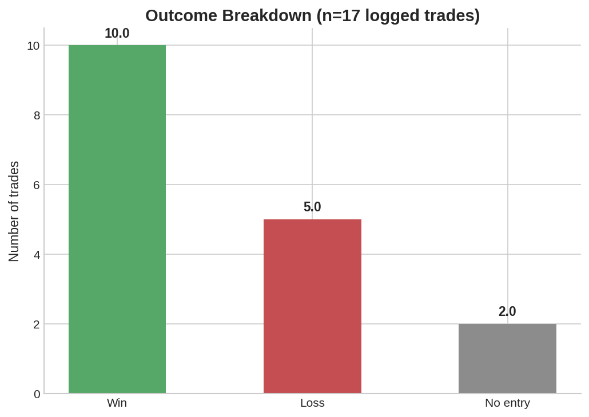
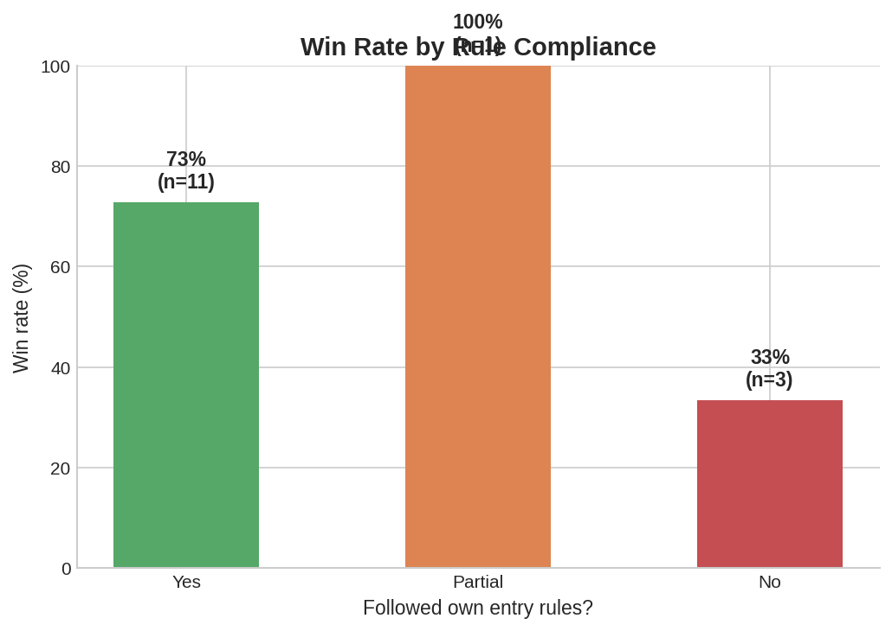

# Statistical Summary

Source: `data/operations.csv` · 17 logged trades (paper trading), 15 executed, 2 discarded before entry ("No entry").

## Headline numbers

| Metric | Value |
|---|---|
| Trades logged | 17 |
| Trades executed | 15 |
| Wins | 10 |
| Losses | 5 |
| Win rate (executed) | **66.7%** |
| Win rate — 0 confluences met | **0%** (0/2) |
| Win rate — norm-compliant Long trades | **100%** (6/6) |
| Win rate — norm-compliant Short trades | **50%** (3/6) |

## 1. Confluence count is a real filter, not decoration

The clearest, most sample-independent signal in the dataset: **every trade taken with zero confluences lost.** That is a small sample (n=2), but both instances also coincide with rule violations and non-neutral emotional states (see §3), so the signal is corroborated by an independent variable, not a coincidence of two random trades.

Interestingly, 3-confluence trades slightly outperformed 4-confluence trades in this sample (77.8% vs. 66.7%). This is very likely sample-size noise combined with the direction effect below (short trades — which underperform — happen to include two of the three 4-confluence losses), not evidence that "fewer confluences is better." It's flagged here specifically because a naive reading of the raw numbers could produce that wrong conclusion — this is the kind of thing the full write-up in the [README](../README.md#what-the-data-actually-says) is careful to caveat.

## 2. Long vs. Short is not symmetric

Restricting to trades that fully complied with the trader's own entry rules:

- **Long: 6/6 — 100%.** Built entirely during a strong, clean uptrend (Jan–Apr 2026). Should not be assumed to hold in range-bound or bearish regimes — there is no data yet for that condition.
- **Short: 3/6 — 50%.**

Reviewing the annotated charts alongside the losing Short trades revealed that **2 of the 3 short losses were stop-placement failures, not directional misreads** — price moved in the anticipated direction but the stop was caught by the sweep wick before the move completed. This reframes the fix: it's a risk-management adjustment (stop placement relative to sweep zones), not a wholesale rejection of the short-side thesis. Full detail in [`strategy/strategy-v2.md`](../strategy/strategy-v2.md#4-direction-specific-rules).

## 3. Rule compliance vs. outcome

The three trades marked as **not** norm-compliant are also the only three with non-neutral logged emotional states or the lowest confluence counts in the dataset. This is the strongest behavioral finding in the project: **discretionary rule-breaking clusters with emotional state, and rule-breaking trades underperform**, even though the sample is small.

## 4. Timeline — where the drawdown lives

Trading activity and outcomes are not evenly distributed across the ~6-month window:

- **Jan–Apr 2026:** low-to-moderate frequency, all Long, undefeated when rules were followed.
- **May 5–19, 2026:** the only losing streak in the dataset. A clean loss (trade #9) is followed by an explicitly self-labeled "revenge trade" (trade #10) and a further undisciplined entry (trade #11) two weeks later — the two only non-neutral emotional states in the whole log fall exactly here.
- **Jun–Jul 2026:** activity resumes, all trades return to a neutral emotional state, and rule compliance returns to 5/6 — consistent with a recovered process after the May drawdown.

## Sample size caveat

This is a young, actively growing dataset (n=17, n=6 per direction on the short side). The directional asymmetry and the confluence-count effect are useful for **behavioral coaching and process design today**, but should not yet be treated as a statistically validated edge. The stated target before drawing harder conclusions is 30–50 trades per direction — see [`strategy/strategy-v2.md`](../strategy/strategy-v2.md#10-when-to-revisit-this-version) for the explicit review criteria.
